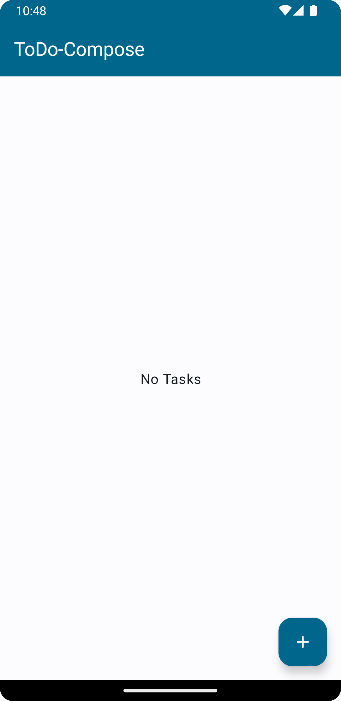
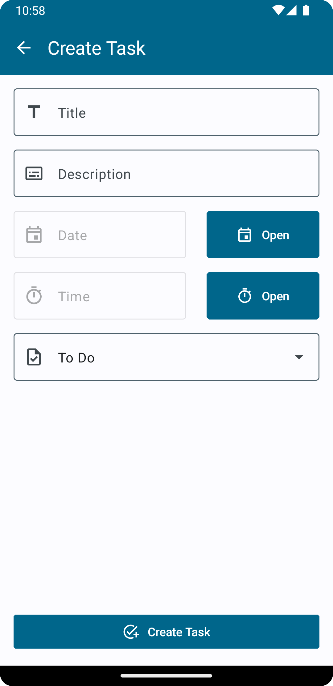
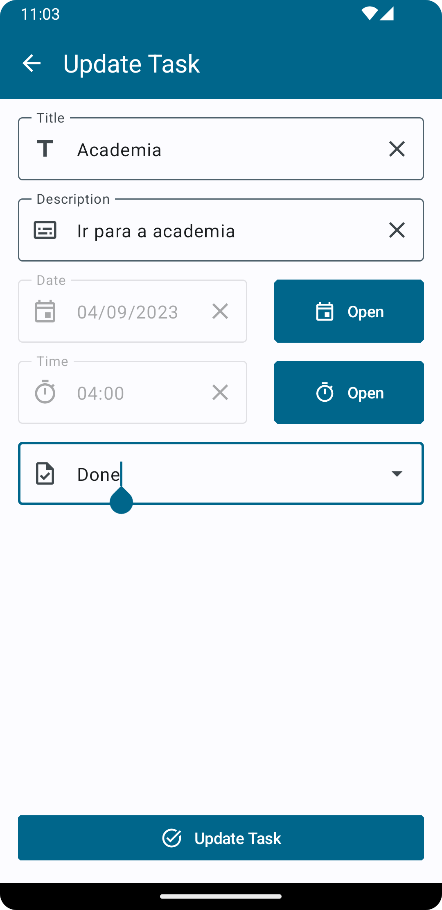
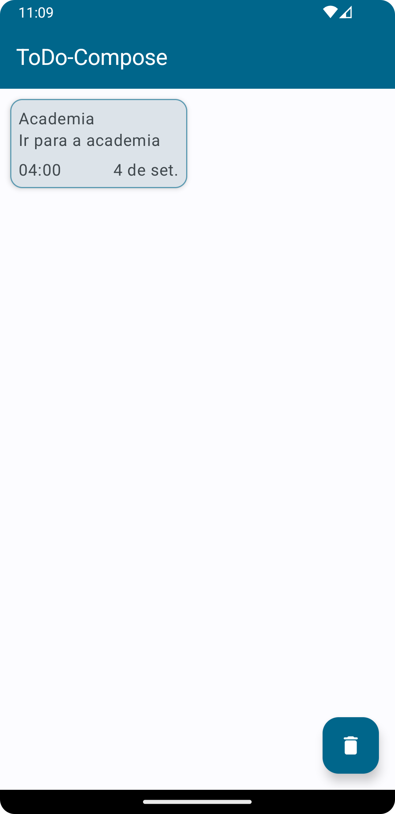
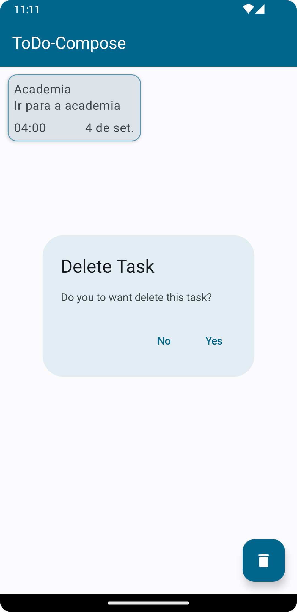
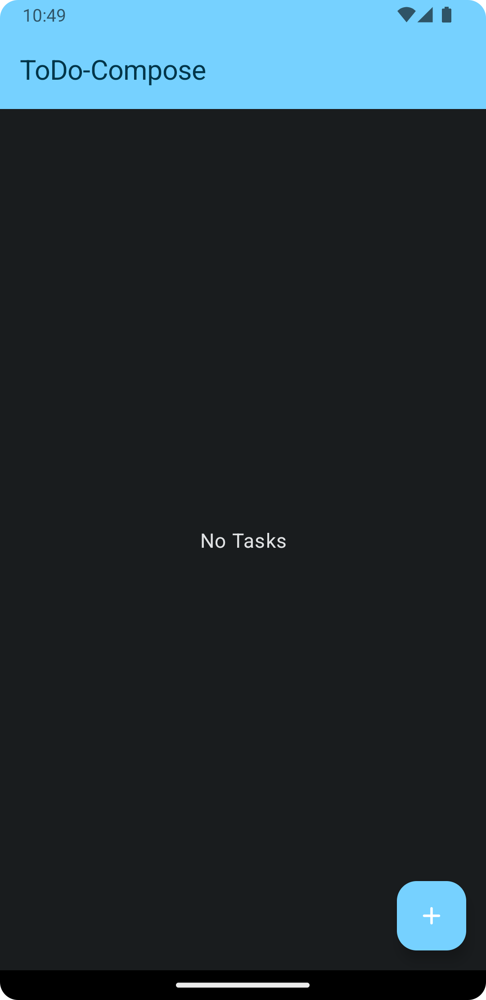
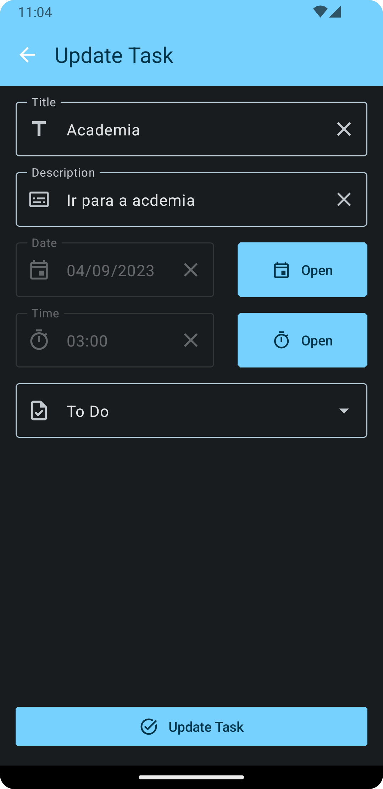
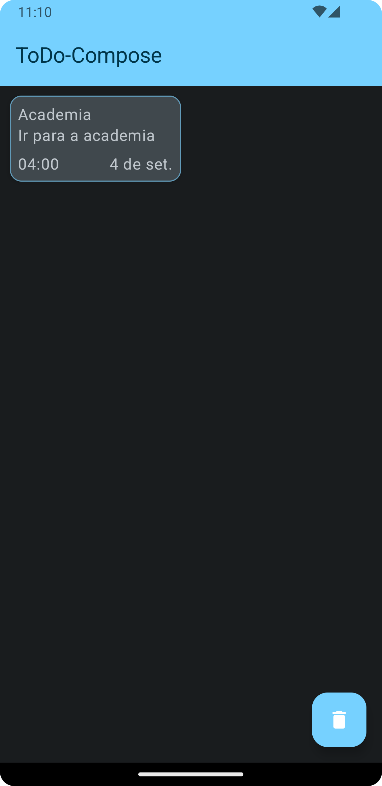
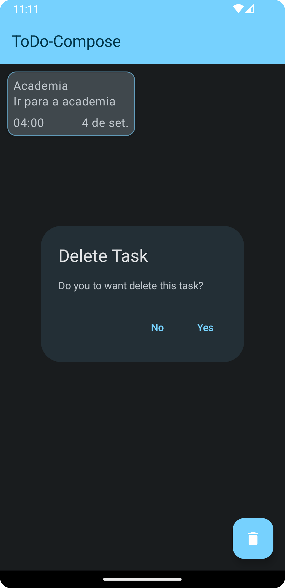

# ToDo-Compose
> Esse projeto tem como objetivo apresentar um aplicativo que cadastra uma ou mais tarefas e exibi-las ao usuário.

Principais características desse projeto 

- Padrão de arquitetura Clean Archicture e MVVM
- Version Catalog (Gradle) e Kotlin DSL
- Injeção de Dependência
- Telas construídas com Android Jetpack (Compose)
- Uso de módulos para determinados contextos
- Testes Unitários
- Relatório de testes unitários

As principais libraries utilizadas no projeto:

- Android Jetpack
- Material 3
- Room
- Koin
- AssertK
- Mockk
- Jacoco

# Modo Light
|           |        |
| --------------------------------------------- | --------------------------------------------- |
| Sem tarefas                                   | Cadastrar tarefa                              |
|        |         |
| Atualizar tarefas                             | Listar tarefas                                |
|  |  |
| Deletar tarefa - Parte 1                      | Deletar tarefa - Parte 2                      |

# Modo Night
|           |        |
| --------------------------------------------- | --------------------------------------------- |
| Sem tarefas                                   | Cadastrar tarefa                              |
|        |         |
| Atualizar tarefas                             | Listar tarefas                                |
|  |  |
| Deletar tarefa - Parte 1                      | Deletar tarefa - Parte 2                      |
